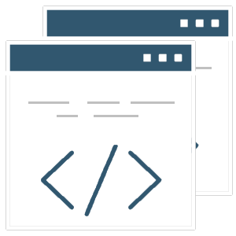

    

        

            
        

        

            
Design your services using GOV.CY styles, components and patterns.

            
Use the design system to make your service consistent with GOV.CY and avoid repeating work that’s already been done. The Design System makes it easy for digital teams to build accessible, consistent, and performant services and products to meet Cyprus' needs.

            
<button type="button" class="govcy-btn-primary" onclick="window.location='getting_started/'">Get Started</button> 

            
This documentation is for <strong>v{{ site.version }}</strong>
            ·
            <a href="https://gov-cy.github.io/govcy-design-system-docs-v0/">v0.1.0 documentation</a>
            ·
            <a href="moving_from_v_0">How to move from Version 0.1.0</a>
            

        

    

    

        

            
 

            <h2>Styles</h2>
                
A visual styles to make your service look like GOV.CY with of colours, images, layouts, grid system, spacing and typography. 

                
<a href="styles/">Browse styles</a>

        

    

        
 

        <h2>Components</h2>
            
Reusable elements of the user interface such as components for forms, navigation, panels, tables and more.

            
<a href="components/">Browse Components</a>

    

    

        
 

        <h2>Patterns</h2>
        
Best practice design solutions for specific user-focused tasks and page types, such as addresses, bank details and so on.

            
<a href="patterns/">Browse Patterns</a>

    

    

